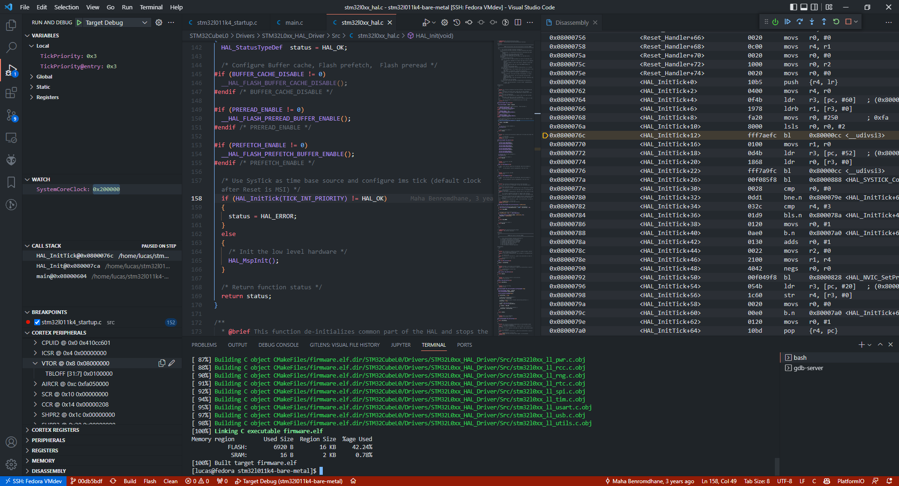

# Bare metal for nucleo_l011k4 

- Tutorials : https://linuxembedded.fr/2021/02/bare-metal-from-zero-to-blink
  - Associated github repo : https://github.com/joved-git/Bare_Metal_STM32
- [STM32Cube demo vscode](https://github.com/EmbeddedGeekYT/egSTM32/tree/vscode)
- Video tutorial : https://www.youtube.com/watch?v=7stymN3eYw0
- Check this : [github.com/cortexm/baremetal](https://github.com/cortexm/baremetal)
- Video tutorial (GDB) : https://www.youtube.com/watch?v=QQcp8CPjkoY

# Build / flash / debug

- Build : `make`
- Flash : `make flash`
- Debug : `Ctrl + F5`
- Clean : `make clean`

---

## Sections

`.text` : code
`.data` : static data (copied to ram)
`.bss` : non-initialize RAM data
`.rodata` : read-only flash data

## Linker script

`lma` : load memory address (initial place)
`vma` : virtual memory address (final place of data in memory)

`.` in linker script always refers to a `vma` address

## TODO: Trouble shooting / known problems

- `section `.bss' type changed to PROGBITS`
- `COMMON` section handling
- When using QEMU, data in flash are all 0, so copy to RAM fails
  - `*(uint32_t(*)[2024])0x8000428`
  - Because QEMU already populate flash with expected value
  - We need to emulate the "boot from flash" / or we need to skip the RAM population
- Using `qemu-system-arm` ?
- Calling `make` after change fails
- Check `-pflash file` option

## Makefile

- add flag `-nostdlib` to `LDFLAGS` to not link with libc
- `^$` : dependencies = `%.c` (e.g. `main.c`)
- `$@` : target (output file) = `%.o`: (e.g. `main.o`)

## Show specific help

`arm-none-eabi-gcc -Wl,--help | grep gc-sections`
arm-none-eabi-gcc --help

## Debug target with OpenOCD and GDB

OpenOCD terminal : 
```
openocd -f interface/stlink.cfg -f target/stm32l0.cfg
```

GDB terminal :
```
arm-none-eabi-gdb
```

Then 
```
target extended-remote localhost:3333
monitor reset init
monitor flash write_image erase firmware.elf
monitor reset halt
monitor resume
monitor reset
```

## Debug in QEMU using GDB

Run `make qemu`
And press `Ctrl + F5`

